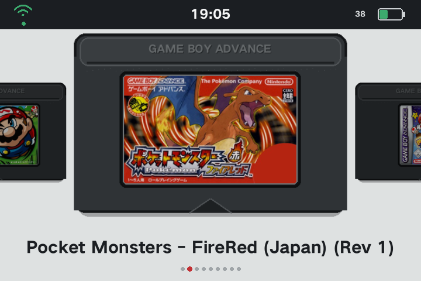

# GAFE

[日本語版](README.ja.md)

GAFE (Game Boy Advance Front End) turns the ANBERNIC RGSP running StockOS into a focused GBA handheld. It launches the StockOS build of RetroArch with the mGBA core and provides a cartridge carousel, Boxart, Wi-Fi setup, persistent hardware volume control, and system controls.



_Captured from the actual device. Game ROMs and Boxart are not included._

## Requirements

- ANBERNIC RGSP with StockOS v1.0.1
- StockOS RetroArch and `mgba_libretro.so`
- StockOS Python 3 with PySDL2 and Pillow
- GBA ROMs in `/mnt/mmc/Roms/GBA`

GAFE does not include RetroArch, the mGBA core, ROMs, or BIOS files.

## Installation

1. Download and extract the GAFE release ZIP.
2. Copy `GAFE-ON.sh`, `GAFE-OFF.sh`, and the `GAFE` directory directly into `Roms/PORTS` on the SD card.
3. On the device, open `RA game` -> `PORTS` -> `GAFE-ON`.
4. The device reboots automatically and starts GAFE.

The resulting layout must be:

```text
Roms/PORTS/GAFE-ON.sh
Roms/PORTS/GAFE-OFF.sh
Roms/PORTS/GAFE/
```

## Updating GAFE

To update an existing GAFE installation:

1. In GAFE, press SELECT and use `Restore StockOS`.
2. Extract the new release ZIP.
3. Replace `GAFE-ON.sh`, `GAFE-OFF.sh`, and the `GAFE` directory in `Roms/PORTS`.
4. On the device, open `RA game` -> `PORTS` -> `GAFE-ON`.

Do not delete `/mnt/mmc/GAFE_HOME`. Saved game selection, volume, GAFE-specific RetroArch settings, and the original StockOS backup remain there and are reused by the new version. ROMs, BIOS files, saves, save states, and Wi-Fi profiles are not removed by the update.

## Controls

| Control | Action |
|---|---|
| D-pad Left / Right | Select a game |
| A | Launch or confirm |
| B | Go back |
| START | Open Wi-Fi settings |
| SELECT | Open the system menu and CPU mode selector |
| Hardware volume buttons | Change and save the system volume |
| SELECT + Volume buttons | Change screen brightness without changing volume |

The system menu provides `Restore StockOS`, `Restart`, and `Shut Down`. Every destructive action opens a confirmation screen with `No` selected by default.

The CPU mode selector provides `Balanced` (`interactive`, default), `Battery Saver` (`ondemand`), and `Performance`. Change it with Left / Right or A. The selection is saved and reapplied at the next GAFE startup.

StockOS provides a screen-brightness shortcut with SELECT + Volume Up / Volume Down. GAFE preserves this shortcut and suppresses volume changes while SELECT is held, so the combination changes brightness only.

## Boxart Setup

GAFE reads the RetroArch GBA playlist and its downloaded thumbnails. Connect the device to Wi-Fi before downloading thumbnails.

### 1. Create the playlist

1. Launch a game.
2. Open the RetroArch menu.
3. Select `Import Contents` -> `Scan Directory` -> `Parent Directory` -> `GBA` -> `Scan This Directory`.

### 2. Download playlist thumbnails

1. Open the RetroArch `Main Menu`.
2. Select `Online Updater` -> `Playlist Thumbnails Updater`.
3. Select `Nintendo - Game Boy / Advance`.

Return to GAFE after the download completes. Available Boxart is fitted into the cartridge label area without cropping.

## What GAFE-ON Changes

GAFE-ON performs the following operations:

- Backs up the device's original StockOS launcher once.
- Installs a small launcher wrapper and GAFE session script.
- Enables GAFE mode with `/etc/gafe-mode`.
- Creates persistent data under `/mnt/mmc/GAFE_HOME`.
- Seeds a persistent GAFE `retroarch.cfg` from the packaged configuration.
- Backs up and applies the packaged global shader preset.
- Backs up and applies the packaged GBA content-directory mGBA options.
- Applies the saved CPU mode to each supported CPU frequency policy when a GAFE session starts; the default is `interactive`.
- Keeps game selection, volume, logs, and GAFE-specific RetroArch settings across reboots and mode changes.

The original launcher and original RetroArch settings are backed up under `/mnt/mmc/GAFE_HOME/backups`. Existing backups are not overwritten by later GAFE-ON runs.

## Persistent GAFE Settings

Settings changed while using GAFE are stored under:

```text
/mnt/mmc/GAFE_HOME/settings
```

This includes the active `retroarch.cfg`, global shader preset, and GBA content-directory mGBA options. GAFE-OFF saves the current GAFE shader and core settings before restoring StockOS. The next GAFE-ON reapplies the saved GAFE settings instead of resetting them to package defaults. GAFE also reapplies the saved shader and mGBA options at each session start, after the StockOS runtime has mounted and initialized its RetroArch directories.

## Restoring StockOS

Open the GAFE system menu with SELECT, choose `Restore StockOS`, then confirm with `Yes`. The device restores StockOS and reboots automatically.

GAFE-OFF restores:

- The original StockOS launcher.
- The global shader preset that existed before the first GAFE-ON.
- The GBA content-directory mGBA options that existed before the first GAFE-ON.
- Normal StockOS startup behavior.

GAFE-OFF does not delete:

- ROMs, BIOS files, saves, or save states.
- Wi-Fi profiles.
- The GAFE package in `Roms/PORTS`.
- Persistent GAFE settings in `/mnt/mmc/GAFE_HOME`.

To enable GAFE again, use `RA game` -> `PORTS` -> `GAFE-ON` from StockOS.

If the frontend cannot be opened, restore StockOS over SSH:

```sh
/mnt/mmc/Roms/PORTS/GAFE-OFF.sh
```

See [Recovery](docs/RECOVERY.md) for additional recovery details.

## Packaged Settings

| File | Purpose |
|---|---|
| `GAFE/retroarch.cfg` | Initial GAFE RetroArch configuration |
| `GAFE/gba-game.cfg` | Per-launch volume input overrides |
| `GAFE/config/global.glslp` | Initial global shader preset |
| `GAFE/config/mGBA/GBA.opt` | Initial GBA content-directory mGBA options |
| `GAFE/assets/xmb-wallpaper.png` | XMB wallpaper |

## Wallpaper Attribution

The included wallpaper is based on **Chill Mario 2023 ver.** by **Pixel Jeff (Jeff Lin)**.

- Artist page: [Chill Mario 2023 ver.](https://www.artstation.com/artwork/RynnOv)
- Upstream asset notice: [game-de-it/rg35xx chillmario.md](https://github.com/game-de-it/rg35xx/blob/main/chillmario.md)
- Local notice: [THIRD_PARTY_NOTICES.md](THIRD_PARTY_NOTICES.md)

The wallpaper is not covered by GAFE's MIT License. Rights to the artwork and depicted characters remain with their respective creator and rights holders.

## Building a Release

Run on macOS or Linux:

```sh
./scripts/verify.sh
./scripts/build-release.sh
```

The release ZIP and SHA-256 checksum are written to `dist`.

## License

GAFE source code is released under the [MIT License](LICENSE). Third-party artwork is covered by its own attribution and terms.
